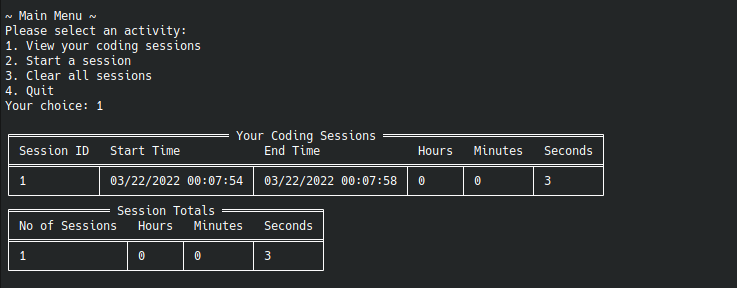

# Coding Tracker App

For all your coding tracking needs!

_Based on the [Coding Tracker](http://www.thecsharpacademy.com/coding-tracker/) assignment from C# Academy_.

This project uses the [ConsoleTableExt](https://github.com/minhhungit/ConsoleTableExt) package for displaying nice
looking tables in the coding sessions viewer.



In order to persist the data for the database, you can clone this repository and change Properties/launchSettings.json -> workingDirectory to
be the directory in which it was cloned to.

You can then either use `dotnet` to run it:

```shell
cd dotnet-coding-tracker
dotnet run
```

Or import it in Visual Studio and build it and run

## Docker

**To run the image from Dockerhub without cloning this repository, simply run this command:**

```shell
docker run -i mattforge/dotnet-coding-tracker:master
```

To pull changes from Dockerhub, run:

```shell
docker pull mattforge/dotnet-coding-tracker:master
```

<br>

### Building the Docker image locally

Clone the repository:

```shell
git clone https://github.com/metallifax/dotnet-coding-tracker
```

To build the image, run:

```shell
docker build -t dotnet-coding-tracker .
```

Run the Docker image in _interactive mode_ (**note:** non interactive mode will just run infinitely)

```shell
docker run -i dotnet-coding-tracker
```